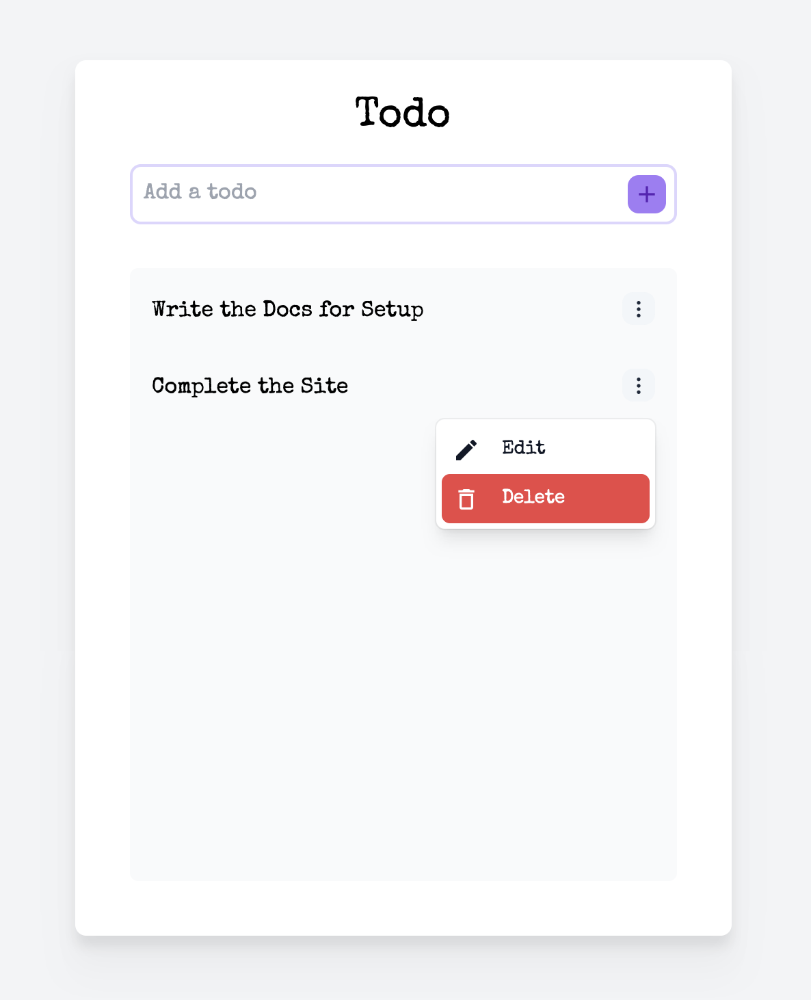

# TODO APP
TODO App with Golang, Next.js, Postgres



## Setup

> Install [Golang](https://go.dev/dl/), [Postgres](https://www.postgresql.org/download/) And [Node](https://nodejs.org/en/)

<br/>

### Clone the repo:
```bash
git clone https://github.com/krishna8421/todo-go-next-pg
```

### Install the Dependencies
```
yarn setup
```

### Start the Postgres server

For Postgres in Docker
> Change User and Password
```
docker run -p 5432:5432 \
    -e POSTGRES_PASSWORD=user \
    -e POSTGRES_USER=password \
    -e POSTGRES_DB=todo \
    postgres
```

> Create an .env file in the backend folder and copy the content from .env.example and fill the values

```
DB_USER=user
DB_PASSWORD=password
DB_NAME=todo
DB_PORT=5432
```

### Run
Open 2 terminal from the root folder and run the following commands 
```
yarn start:backend
```
&
```
yarn start:frontend
```

> The Frontend will start on localhost:3000 and the Backend will start on localhost:8000